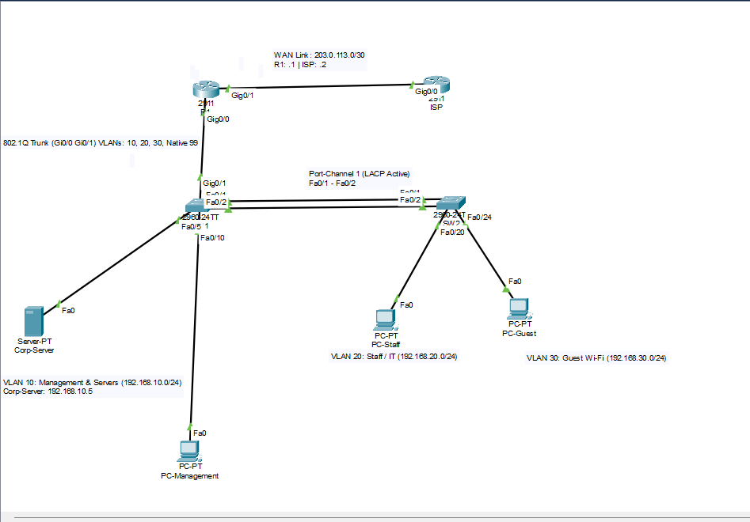

Enterprise Network Design & Implementation

A Cisco Packet Tracer project focused on the design, configuration, and verification of a segmented enterprise network. The project demonstrates practical implementation of Cisco routing and switching concepts, network segmentation, Layer 2 security, traffic control, IP address management, and Internet connectivity.

Project Overview

This project simulates an enterprise network with separate Staff and Guest networks. The network was designed to provide logical segmentation, controlled communication between network segments, reliable connectivity between switches, automatic IP address assignment, and external network access.

The project was implemented and tested using Cisco Packet Tracer and Cisco IOS command-line configuration.

Network Topology



Technologies & Concepts

* Cisco Packet Tracer
* Cisco IOS
* VLANs
* 802.1Q Trunking
* Native VLAN
* Inter-VLAN Routing
* DHCP
* Access Control Lists (ACLs)
* NAT/PAT
* EtherChannel
* LACP
* Spanning Tree Protocol (STP)
* PortFast
* BPDU Guard
* Port Security
* Default Routing
* WAN Connectivity

Network Segmentation

The network uses VLANs to separate different groups of users into independent Layer 2 broadcast domains.

| VLAN    | Purpose     |
| ------- | ----------- |
| VLAN 10 | Staff       |
| VLAN 20 | Guest       |
| VLAN 99 | Native VLAN |

The Staff and Guest networks use separate IP subnets. Inter-VLAN communication is handled through Layer 3 routing and controlled according to the configured network policies.

Key Implementations

VLANs and Trunking

VLANs were configured to provide logical network segmentation. 802.1Q trunking was implemented between network devices to transport multiple VLANs across shared links.

A dedicated native VLAN was configured for trunk connections to handle untagged traffic.

Inter-VLAN Routing

Inter-VLAN routing was implemented to allow communication between different IP networks where required.

This enables devices in separate VLANs to communicate through the Layer 3 routing function of the network.

DHCP

DHCP was configured to automatically provide clients with essential network configuration, including:

* IP address
* Subnet mask
* Default gateway
* DNS server

This removes the need to manually configure IP addressing on individual client devices.

Access Control Lists

Access Control Lists were configured to control traffic between network segments according to the defined access requirements.

ACLs were used to permit or deny specific traffic based on network addresses and traffic characteristics.

NAT/PAT

Network Address Translation with Port Address Translation (NAT/PAT) was configured to allow multiple private-network devices to access external networks using a shared public IP address.

PAT uses transport-layer port numbers to distinguish simultaneous connections from different internal hosts.

EtherChannel and LACP

EtherChannel was implemented to combine multiple physical links into a single logical connection.

LACP was used to negotiate and manage the link aggregation, providing:

* Link redundancy
* Increased aggregate bandwidth
* A logical Port-channel interface

Layer 2 Security

Several Layer 2 security and stability mechanisms were implemented:

* Port Security — restricts unauthorized MAC addresses on access ports.
* PortFast — allows designated edge ports to transition to the forwarding state quickly.
* BPDU Guard — protects edge ports by placing the port into an error-disabled state when unexpected BPDUs are received.

#Default Routing and WAN Connectivity

A default route was configured to provide a path toward external networks when the destination network is not present in the router's routing table.

A WAN interface was used to provide connectivity toward the external/ISP side of the topology.

Connectivity Flow

A simplified Internet-access flow is:

```text
Client
   ↓
Access VLAN
   ↓
Switch
   ↓
Inter-VLAN Routing / Default Gateway
   ↓
ACL Processing
   ↓
NAT/PAT
   ↓
Default Route
   ↓
WAN / ISP
   ↓
Internet
```

The router performs the required Layer 3 forwarding and NAT/PAT translation before traffic is sent toward the external network.

Verification & Testing

The implementation was verified using Cisco IOS show commands and end-to-end connectivity tests.

Testing included:

* VLAN membership verification
* Trunk verification
* Native VLAN verification
* Inter-VLAN connectivity
* DHCP address assignment
* ACL behavior
* EtherChannel/LACP status
* Port Security configuration
* PortFast and BPDU Guard configuration
* NAT/PAT translation
* Default route verification
* WAN connectivity
* End-to-end network connectivity

Project Files

| File                     | Description                          |
| ------------------------ | ------------------------------------ |
| `enterprise-network.pkt` | Complete Cisco Packet Tracer project |
| `network-topology.png`   | Network topology diagram             |
| `router-config.txt`      | Router configuration                 |
| `switch1-config.txt`     | Switch configuration                 |
| `switch2-config.txt`     | Additional switch configuration      |

Tools

Cisco Packet Tracer
Used to design, configure, simulate, test, and troubleshoot the enterprise network.

Cisco IOS CLI
Used to configure and verify routing, switching, security, DHCP, NAT/PAT, and other network services.

Learning Outcomes

Through this project, I gained practical experience with:

* Enterprise network segmentation
* Cisco switching and routing
* VLAN and trunk configuration
* Inter-VLAN communication
* IP addressing and DHCP
* Traffic filtering with ACLs
* NAT/PAT and external connectivity
* Link aggregation using EtherChannel/LACP
* Layer 2 security mechanisms
* Routing and WAN connectivity
* Network verification and troubleshooting

## Project Objective

The objective of this project was to develop practical networking skills by designing, configuring, testing, and troubleshooting a complete enterprise network environment using Cisco Packet Tracer.
